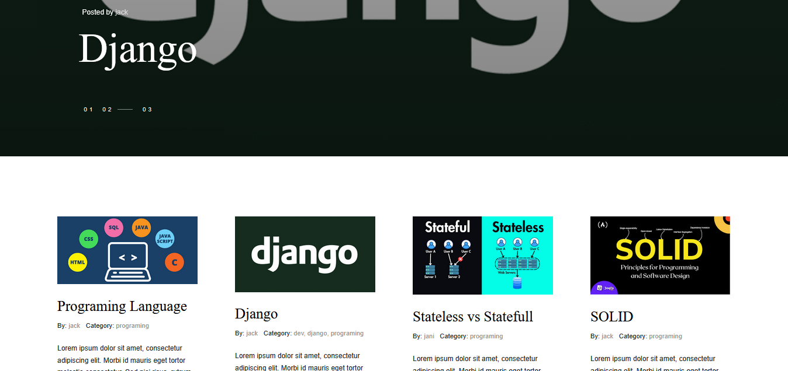

<section style="max-width:700px; margin:auto; font-family:Arial, sans-serif; line-height:1.7; color:#333;">
  <h1 style="text-align:center; color:#2c3e50;">Django Blog Project</h1>

  <p align="center">
  
  </p>

  <h2 style="color:#34495e;">About the Project</h2>
  <p>
    This project was created to practice my Django skills and improve my understanding of Django development.
  </p>

  <h2 style="color:#34495e;">Project Goal</h2>
  <p>
    The goal of this project is to create a programming blog that shares practical information — making it easier for beginner developers to access helpful and concise content during their learning journey.
  </p>
</section>


<h2>Features</h2>
<ul>
  <li>Session Authentication</li>
  <li>Searching</li>
  <li>Filtering</li>
  <li>Commenting</li>
</ul>


<h2>Technologies</h2>
<ul>
  <li>Python</li>
  <li>Django</li>
  <li>SQLite</li>
  <li>HTML, CSS, JavaScript</li>
</ul>


<h2>⚙️ Installation (Windows)</h2>

<p>Follow these steps to set up and run the project locally.</p>

<hr>

<h3>1. Clone the repository</h3>

```bash
git clone https://github.com/mhmdheydarii/Django-Blog-Project.git
```

<br>

<h3>2. Navigate to the project directory</h3>

```bash
cd django_blog_project
```

<br>

<h3>3. Create a virtual environment</h3>

```bash
python -m venv .venv
```

<br>

<h3>4. Activate the virtual environment</h3>

<p><b>CMD</b></p>

```cmd
.venv\Scripts\activate
```

<p><b>PowerShell</b></p>

```powershell
.\.venv\Scripts\Activate.ps1
```

<p>
After activation, you should see something similar to:
</p>

```bash
(.venv)
```

<p>
at the beginning of your terminal line.
</p>

<br>

<h3>5. Install dependencies</h3>

<p>If the project includes a <code>requirements.txt</code> file:</p>

```bash
pip install -r requirements.txt
```
<br>

<h3>6. Configure environment variables</h3>

<p>Create a .env file in the project root and add the required environment variables.</p>

```bash
DEBUG=True
SECRET_KEY=secret_key
ALLOWED_HOST="*"
```
<br>

<h3>7. Run the project</h3>


```bash
python manage.py makemigrations
```
```bash
python manage.py migrate
```
```bash
python manage.py runserver
```

<hr>

<details>
<summary><b>❌ Deactivate Virtual Environment</b></summary>

<br>

To exit the virtual environment:

```bash
deactivate
```

</details>

<br>

<p align="center">
⭐ If you found this project useful, consider giving it a star.
</p>
